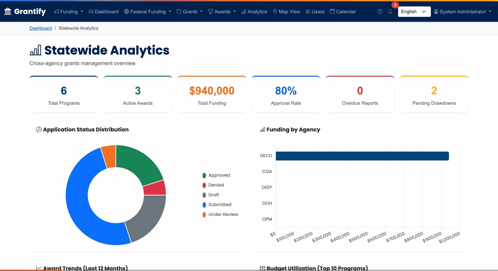

# Harbor

**Enterprise grants management platform for state agencies.** End-to-end lifecycle coverage from opportunity posting through award closeout.

[](https://www.python.org/downloads/)
[](https://www.djangoproject.com/)
[](LICENSE)
[](https://github.com/okeefedaniel/harbor/actions)



## Live Demo

**[https://harbor.docklabs.ai](https://harbor.docklabs.ai)**

Log in with any demo account (password: `demo2026`):

| Username | Role | Description |
|----------|------|-------------|
| `agency.admin` | Agency Admin | Manages grants and staff for a state agency |
| `program.officer` | Program Officer | Creates grant programs, reviews applications |
| `fiscal.officer` | Fiscal Officer | Manages financial transactions and drawdowns |
| `reviewer` | Reviewer | Scores and evaluates grant applications |
| `applicant` | Applicant | Submits applications and manages awards |
| `auditor` | Auditor | Read-only access for compliance monitoring |
| `fed.coordinator` | Federal Coordinator | Tracks federal opportunities, AI matching |

## Features

### Grant Lifecycle Management
- **Opportunity Posting** &mdash; Create and publish grant programs with eligibility criteria, budgets, and deadlines
- **Application Portal** &mdash; Multi-step application forms with document uploads and draft auto-save
- **Review & Scoring** &mdash; Configurable rubrics, reviewer assignment, and scoring workflows
- **Award Management** &mdash; Award creation, budget tracking, and amendment processing
- **Financial Tracking** &mdash; Drawdown requests, transaction ledger, and state ERP integration
- **Reporting** &mdash; Configurable report templates, due-date tracking, and SF-425 federal reporting
- **Closeout** &mdash; Final reporting, compliance verification, and award archival

### AI-Powered Grant Matching
- Claude API integration for intelligent opportunity-to-preference matching
- Per-user API key management (BYO key)
- Relevance scoring with natural language explanations
- Thumbs up/down feedback loop to improve recommendations

### Document Signing & Signature Workflows
- Configurable signature flows with sequential approval steps
- Template builder wizard for drag-and-drop flow creation
- PDF placement editor for positioning signature fields on documents
- Three signature methods: typed, uploaded image, or drawn on-screen
- Role-based signing steps (assign by user or by organizational role)
- DocuSign integration for external e-signatures (JWT auth, webhooks)
- Also available as **[Manifest](https://manifest.docklabs.ai)** &mdash; a standalone document signing platform

### Interactive Map View
- Mapbox GL JS choropleth showing grant distribution by municipality
- Filterable by agency, program, and date range
- GeoJSON data for 169 municipalities

### Analytics Dashboard
- Chart.js visualizations (doughnut, bar, line, grouped bar)
- 6 KPI cards with real-time aggregations
- Per-agency funding breakdown

### Additional Capabilities
- **RBAC** &mdash; 7 roles with granular permissions (Agency Admin, Program Officer, Fiscal Officer, Reviewer, Applicant, Auditor, Federal Coordinator)
- **Microsoft SSO** &mdash; Entra ID integration via django-allauth with MFA support
- **REST API** &mdash; 11 DRF endpoints with throttling, filtering, and pagination
- **Multi-language** &mdash; English/Spanish i18n with session-based switching
- **Audit Logging** &mdash; Full audit trail with IP tracking and CSV export
- **Notification System** &mdash; In-app + email notifications with clickable items
- **Batch Operations** &mdash; Bulk status changes, CSV export, and data archival
- **Deadline Calendar** &mdash; Visual calendar view of upcoming deadlines

## Tech Stack

| Layer | Technology |
|-------|-----------|
| Backend | Django 6.x, Python 3.12 |
| Database | PostgreSQL 16 (SQLite for local dev) |
| Frontend | Bootstrap 5.3, Chart.js, Mapbox GL JS |
| Auth | django-allauth (SSO + MFA), session-based RBAC |
| API | Django REST Framework |
| AI | Anthropic Claude API |
| e-Signatures | DocuSign eSign REST API |
| Deployment | Railway, Gunicorn, WhiteNoise |
| CI/CD | GitHub Actions (lint, test, security scan) |

## Architecture

The project is organized into 9 Django apps, each owning a distinct domain:

```
harbor/
  core/          Auth, users, organizations, audit logging, notifications
  portal/        Public-facing pages (home, about, opportunities, demo guide)
  grants/        Grant programs, federal opportunities, AI matching, preferences
  applications/  Application submission, documents, review workflow
  reviews/       Reviewer assignment, scoring rubrics, evaluations
  awards/        Award management, amendments, DocuSign signatures
  financial/     Transactions, drawdowns, state ERP integration
  reporting/     Report templates, submissions, SF-425 federal reports
  closeout/      Final reports, compliance verification, archival
```

## Quick Start

```bash
# Clone
git clone https://github.com/okeefedaniel/harbor.git
cd beacon

# Virtual environment
python -m venv venv
source venv/bin/activate  # Windows: venv\Scripts\activate

# Dependencies
pip install -r requirements.txt

# Environment
cp .env.example .env
# Edit .env — at minimum set DJANGO_DEBUG=True

# Database
python manage.py migrate

# Seed demo data (creates users, agencies, grants, applications, awards)
python seed_data.py

# Run
python manage.py runserver
```

Visit [http://localhost:8000](http://localhost:8000) and log in with any demo account above.

## Environment Variables

| Variable | Required | Description |
|----------|----------|-------------|
| `DJANGO_SECRET_KEY` | Production | Secret key (auto-generated for dev) |
| `DJANGO_DEBUG` | No | `True`/`False` (default: `False`) |
| `DEMO_MODE` | No | Enable demo quick-login (default: follows DEBUG) |
| `DATABASE_URL` | Production | PostgreSQL connection string |
| `MAPBOX_ACCESS_TOKEN` | For map view | Mapbox GL JS token |
| `ANTHROPIC_API_KEY` | For AI matching | Claude API key (or set per-user in profile) |
| `GRANTS_GOV_API_KEY` | For federal opps | Simpler Grants.gov API key |
| `MICROSOFT_CLIENT_ID` | For SSO | Azure Entra ID app client ID |
| `MICROSOFT_CLIENT_SECRET` | For SSO | Azure Entra ID client secret |
| `DOCUSIGN_INTEGRATION_KEY` | For e-sign | DocuSign app integration key |
| `DOCUSIGN_ACCOUNT_ID` | For e-sign | DocuSign account ID |

See [`.env.example`](.env.example) for the full list.

## Testing

```bash
# Run all 138 tests
python manage.py test

# With coverage
coverage run manage.py test
coverage report --show-missing
```

CI runs automatically on push via GitHub Actions &mdash; Python 3.12/3.13 matrix, PostgreSQL, flake8 linting, coverage threshold, and security scanning (safety + bandit).

## License

[MIT](LICENSE)
